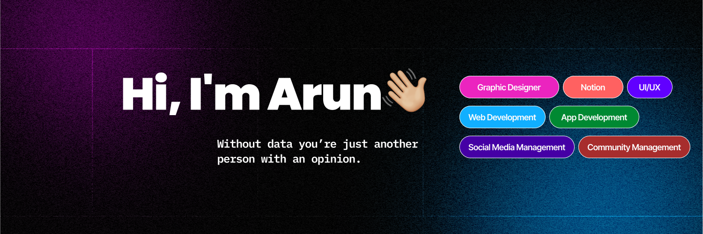

<h1 align="center">Hi 👋, I'm Arun Kumar Kushwaha</h1>

21 | Developer | Secretary I&E Cell, aitpune | 2x hackathon winner

<!--  -->

📫 How to reach me **austen.dezigns.dev@gmail.com**

<h3 align="left">Connect with me:</h3>

  
  
  
  
  

###

<h3 align="left">Languages and Tools:</h3>

  
  
  
  
  
  
  
  
  
  
  
  
  
  
  
  
  
  
  
  
  
  
  
  
  
  
  
  
  
  
  
  
  
  
  
  
  
  
  
  
  
  
  
  
  
  
  
  
  
  
  
  
  
  
  
  
  
  
  

###

<h3>Statistics:</h3>

	

